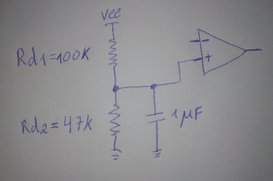
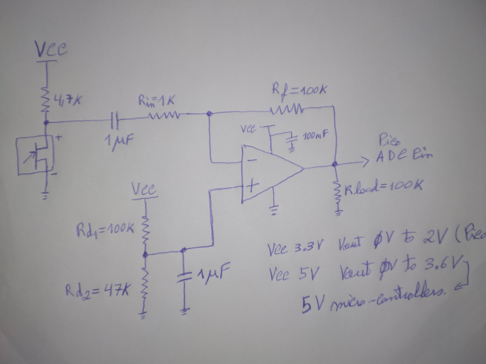

# OpAmps - How to use LM358P and LM324N in single supply
Just some personal notes from measures I did with an oscilloscope, signal generator and power supply.

## Description
The OpAmps, LM358P (2 channels, bandwidth 700 KHz) and the LM324N (4 channels bandwidth 1 MHz) are probably the most common available and cheapest OpAmps. They can be used as dual supply or single supply but they are not rail-to-rail OpAmps. For that use something like the MCP6002 (2 channels, bandwidth 1 MHz) or MCP6004 (4 channels, bandwidth 1 MHz), but those last two are less available in small electronic stores. If you need more precision (better voltage offset specs) and or more bandwidth you can go with the faster MCP6022 (2 channels bandwidth 10 MHz) that's also rail-to-rail. <br>
<br>
But for this notes the problem in hands is how to use those 2 OpAmp LM358P or LM324N with a signal path to use in a ADC (for example of a Raspberry Pi Pico) that can only receive a voltage at his ADC pin of 3.3 V . <br>
<br>
Because the OpAmp have a single Supply, you will need to make a reference voltage of VCC / 2 and give to the none inverting pin of the OpAmp, with a 1 uF cap to stabilize the voltage reference.<br>
<br>
But because LM358P and LM324N need more head room at the top (VCC), although they can start at zero volts. We need to make a non symmetrical voltage divider. The values I tested are the following.<br>
<br>
<br>
<br>

|VCC supply Volt|Vin offset|VOut range    |Rd1    |Rd2   |
|---------------|----------|--------------|-------|------|
| 3.3 V         | 1.050 V  | 0 V to 2 V   | 100 K | 47 K | 
| 5 V           | 1.8 V    | 0 V to 3.6 V | 100 K | 56 K |

```
Vout = (Vsource * Rdv2) / (Rd1 + Rd2)
```


## Inverting amplifier equations

```
OpAmp_gain = Rf / Rin  

Vout = -Vin * (Rf / Rin)

Max_signal_bandwidth =  OpAmp_bandwidth / gain
```

## Simple example - Electret microphone amplifier for ADC processing in Raspberry Pico. 

The Pico has a 3.3 V power supply and the board (RP-Pico) normally can be powered by 5 V from USB. On the board there is a voltage converter that steps down the 5V to 3.3V and the pin's of the Pico are not 5 V tolerant. So you can only give them 3.3 V max. This includes the ADC 12 bit's (4096 values) pins. <br>
Suppose that we are making a whistle detector device that talk a different phrase in response to each kind of whistle. The architecture of this project would be, the signal enters the electret microphone it is amplified by it's internal JFET to 5 mVpp Pk to Pk. Then the signal path goes to a decoupling capacitor and goes into an inverted amplifier with VCC of 3.3 V, with a gain x100 and an offset of 1.050 V . It then goes into the ADC pin of the Pico, and do the sampling for to a buffer at 40 KSamples/sec and then we make an FFT, analyze and process the FFT output to detect the 5 types of whistles: <br>
<br>
```
1 - One whistle single tone. 
2 - Two whistle single tone.
3 - One continues whistle from low frequency to high frequency.
4 - One continues whistle from high frequency to low frequency.
3 - One continues whistle from low frequency to high frequency to low frequency again.
```
<br>
The program will process each FFT output and analyse several FFT's output in a running windows manner.<br>
<br>
Then it will have 5 small phrases in the flash of the chip 2 MBytes, compressed with ADPCM and will decompress them in real time. See STM32F103 AppNote on ADPCM for an example with code in C. <br>
<br>
Then it will generate a PWM for each sample controlled by a timer, and set's the signal instantaneous output voltage (with a low pass filter) to a LM386 Audio amplifier IC or we can make a Class D amplifier directly from the PWM and a MOSFET transistor. Then connect to a small speaker. <br>


### Schematic


### Important Notes

The 12 bit's ADC from the Pico, 4096 values will be from 0 V to 3.3 V, equally spaced. But with a "common" electret microphone it will put out 5 mVpp Pk to Pk and with a gain of x100 we will amplify to 500 mVpp (centered at VRef or Vin offset) at normal speaking volume at 20 cm from the microphone. So the range of values in each sample will normally be between 0 and 620. But because we will be processing with a FFT buffer that will not be a problem to detect and process those whistles. FFT will give a kind of improved resolution for each buffer of 4096 samples, because a pure tone and whistles kinds of make a signal synchronized average it will correspond to a higher resolution, with the FFT we get that as a bonus.

# License
MIT Open Source license

# Have fun!
Best regards, <br>
João Nuno Carvalho
